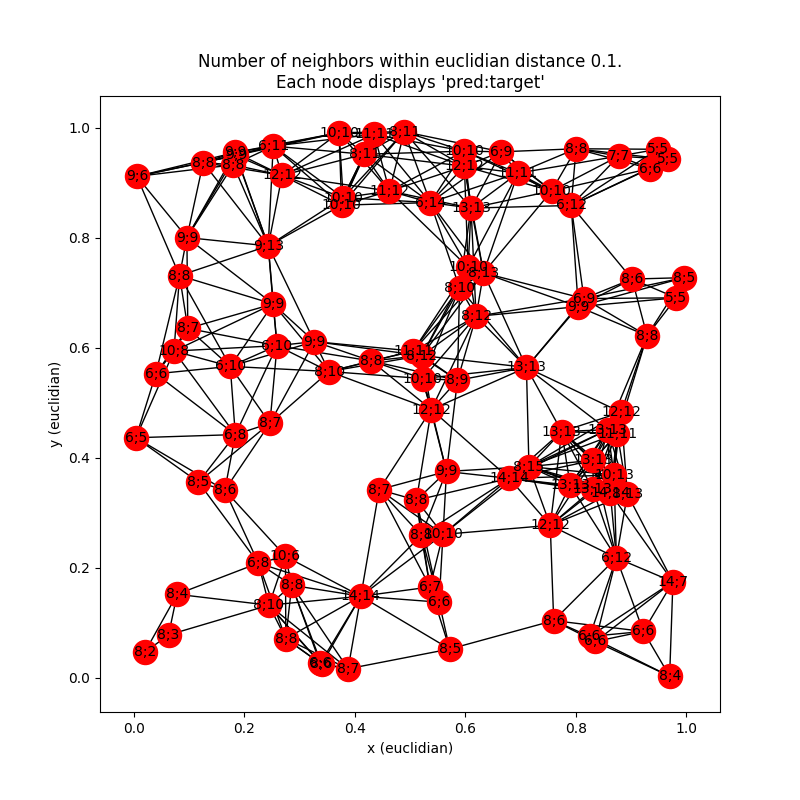

# GNN Toy Example
Getting familiar with Graph Neural Nets and the pytorch_geometric library

### This repo addresses the following problem:

For a given random geometric graph in a plane, predict the number of
neighbors within a threshold distance θ. In particular:

1. Randomly sample N nodes in a unit square.
2. Connect nodes within a threshold distance θ_max.
3. Label each node with the number of direct neighbors within
  distance θ < θ_max.
4. Train a GNN to predict the label of each node.

